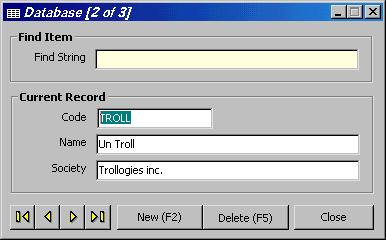



## Database \(Management\)

### Description

A perfect example of using an Access database. With these example, you can add, delete, moving in the database. All validation is done. Use PageUp and PageDown to seek records. Very nice interface. Reusable code. All code is commented. Simply the best example ever on planet-source code about database management.
 
### More Info
 

             |
---                |---
**Submitted On**   |2000-11-03 15:53:16
**By**             |[Troll](https://github.com/Planet-Source-Code/PSCIndex/blob/master/ByAuthor/troll.md)
**Level**          |Advanced
**User Rating**    |4.3 (26 globes from 6 users)
**Compatibility**  |VB 6\.0
**Category**       |[Databases/ Data Access/ DAO/ ADO](https://github.com/Planet-Source-Code/PSCIndex/blob/master/ByCategory/databases-data-access-dao-ado__1-6.md)
**World**          |[Visual Basic](https://github.com/Planet-Source-Code/PSCIndex/blob/master/ByWorld/visual-basic.md)
**Archive File**   |[CODE\_UPLOAD112641132000\.zip](https://github.com/Planet-Source-Code/troll-database-management__1-12506/archive/master.zip)

